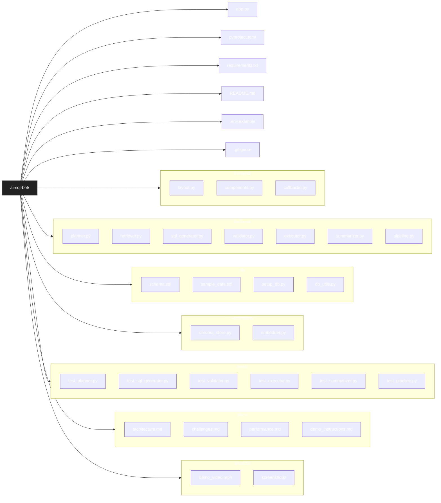
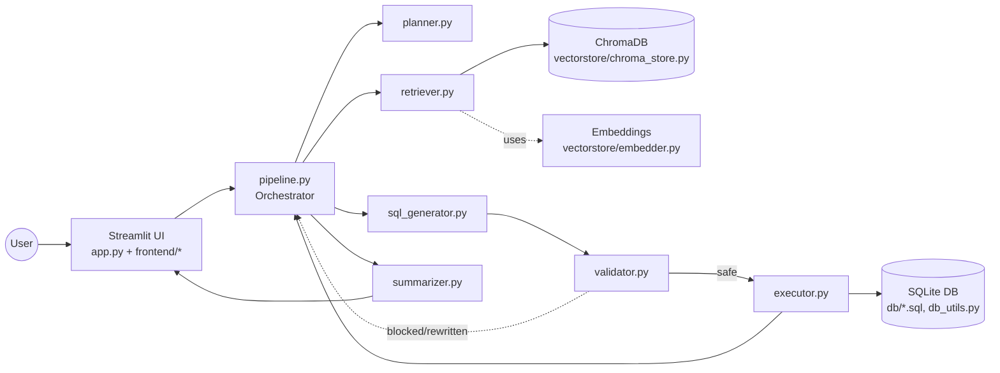
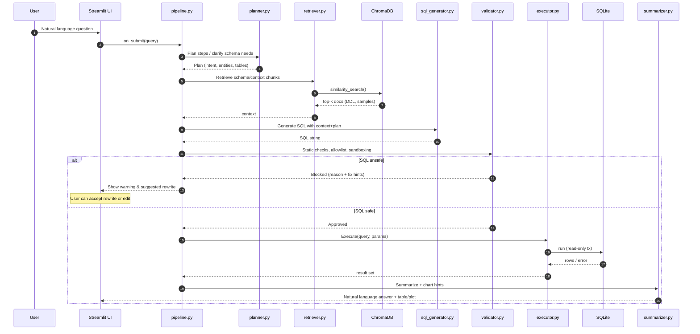
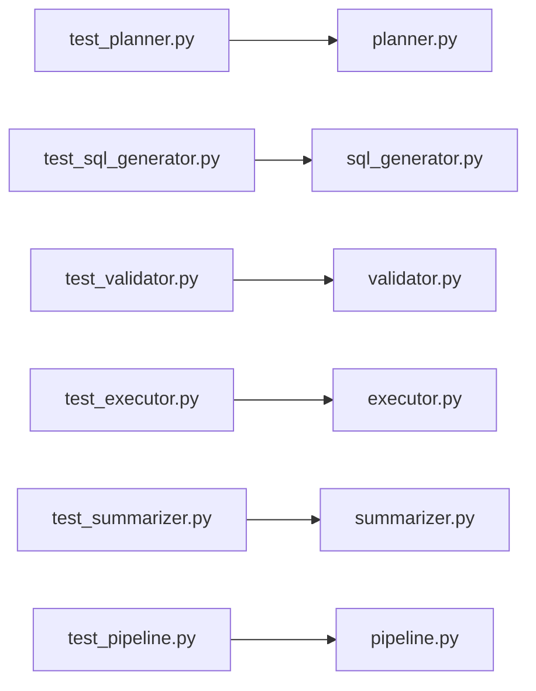

# AI SQL Bot — Mermaid Diagrams

> GitHub renders Mermaid code blocks in Markdown automatically. Just commit this file to your repo (e.g., `docs/diagrams.md` or your `README.md`).

## 1. Project Structure



## 2. High-level Architecture



## 3. Agentic Workflow (Sequence)



## 4. SQL Safety Checks

```mermaid
flowchart TD
    A[Proposed SQL] --> B{Contains write ops?}
    B -- Yes --> X[Reject / require override]
    B -- No --> C{Access only known tables/cols?}
    C -- No --> X
    C -- Yes --> D{Regex/AST forbidden patterns<br/>(; DROP, PRAGMA, ATTACH, DETACH,<br/> ;-, --, /* */ in risky spots)}
    D -- Fail --> X
    D -- Pass --> E{Query complexity limits<br/>(row caps, timeouts, joins)}
    E -- Exceeds --> X
    E -- OK --> F[Approve for execution]
```

## 5. Test Coverage Map



## 6. Demo Run Path

```mermaid
flowchart LR
    start([Start app.py]) --> S1[Load .env / config]
    S1 --> S2[Init vectorstore + embeddings]
    S2 --> S3[Ensure SQLite setup_db.py ran]
    S3 --> UI[Render Streamlit UI]
    UI --> Q{User asks a question}
    Q -->|submit| P[pipeline.run()]
    P --> OUT[Answer + table + optional chart]
    OUT --> end([Done])
```
